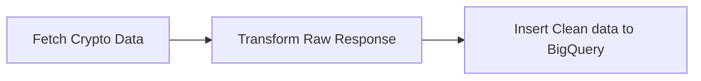

# Cryptocurrency Data Pipeline

Near real time data pipeline for top 100 cryptocurrency coins data using [Coingecko API](https://www.coingecko.com/en/api/documentation). The data pipeline is made as a function in [Google Cloud Function](https://cloud.google.com/functions) to be executed every 5 minutes through [Google Cloud Scheduler](https://cloud.google.com/scheduler) trigger.



| symbol | name     | current_price | market_cap   | market_cap_rank | fully_diluted_valuation | total_volume | ...  |
| ------ | -------- | ------------- | ------------ | --------------- | ----------------------- | ------------ | ---- |
| btc    | Bitcoin  | 19494.84      | 374289077997 | 1               | 409756957292            | 23662114103  | ...  |
| eth    | Ethereum | 1328.6        | 160333583155 | 2               |                         | 8698392798   | ...  |
| usdt   | Tether   | 1             | 68488007086  | 3               |                         | 30216495050  | ...  |
| bnb    | BNB      | 274.46        | 44807811887  | 4               | 45312700938             | 44544105     | ...  |
| ...    | ...      | ...           | ...          | ...             | ...                     | ...          | ...  |

After fetching the cryptocurrency data using the Coingecko API, the script will transform the raw response into a clean data fitting the schema of BigQuery `dataset.table`. This whole pipeline is simply a [Python (3.8) script](https://github.com/darren-sm/crypto-data-pipeline/blob/main/main.py) hosted in Cloud Function to be triggered regularly for every 5 minutes through Cloud Scheduler HTTP request.

```
*/5 * * * * <link-to-crypto-cloud-function>
```

